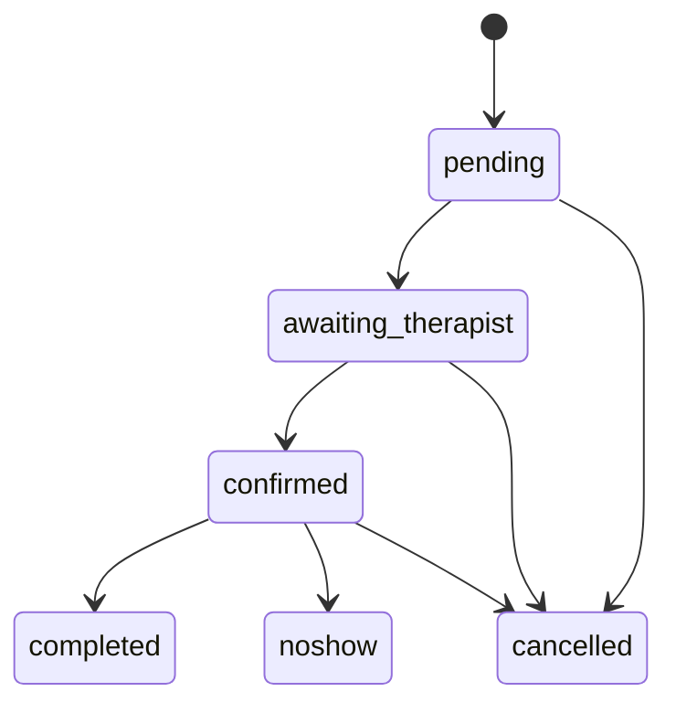

A **Booking** represents a reservation for a specific treatment at a specific
slot. Bookings created through the Partner API are tagged with
`client_type = "partner"` and `payment_method = "partner_billed"` — the
financial settlement happens separately between the partner, the venue and
Eïa.

## Lifecycle



| Status                  | Meaning                                                               |
| ----------------------- | --------------------------------------------------------------------- |
| `pending`               | Booking created, waiting for immediate system validation              |
| `awaiting_therapist`    | Broadcast to available therapists; waiting for one to accept         |
| `confirmed`             | A therapist accepted; the booking is locked and the customer notified |
| `completed`             | The treatment took place                                              |
| `cancelled`             | Cancelled by customer, partner, venue or Eïa                          |
| `noshow`                | Customer did not show up for the appointment                          |

<Note>
  In most cases, bookings created via `POST /v1/bookings` land directly in
  `confirmed` because the Eïa engine assigns a therapist atomically at
  creation time. The `awaiting_therapist` state appears only for venues that
  are configured to broadcast bookings (typically 1–10 minutes window).
</Note>

## The Booking object

<ResponseField name="id" type="string">
  Stable identifier (UUID). Use this for all subsequent API calls.
</ResponseField>

<ResponseField name="booking_number" type="integer">
  Short, human-readable booking number. Displayed to customers and venue
  staff.
</ResponseField>

<ResponseField name="status" type="string">
  One of the values listed above.
</ResponseField>

<ResponseField name="venue_id" type="string">
  Venue where the treatment takes place.
</ResponseField>

<ResponseField name="treatment_id" type="string">
  Treatment booked.
</ResponseField>

<ResponseField name="variant_id" type="string">
  Specific variant booked.
</ResponseField>

<ResponseField name="start_at" type="string (ISO 8601 UTC)">
  Scheduled start.
</ResponseField>

<ResponseField name="end_at" type="string (ISO 8601 UTC)">
  Scheduled end.
</ResponseField>

<ResponseField name="duration" type="integer">
  Duration in minutes.
</ResponseField>

<ResponseField name="guest_count" type="integer">
  Number of guests.
</ResponseField>

<ResponseField name="guest" type="Guest">
  Guest information (see below).
</ResponseField>

<ResponseField name="therapist" type="Therapist | null">
  Assigned therapist, or `null` while in `awaiting_therapist`.
</ResponseField>

<ResponseField name="notes" type="string | null">
  Free-text notes passed at creation.
</ResponseField>

<ResponseField name="external_reference" type="string | null">
  Your own reference as provided at creation (e.g. your internal booking id).
</ResponseField>

<ResponseField name="price" type="Money">
  `{ amount, currency }` — total price of the booking.
</ResponseField>

<ResponseField name="client_type" type="string">
  Always `"partner"` for bookings created through the Partner API.
</ResponseField>

<ResponseField name="payment_method" type="string">
  Always `"partner_billed"` for bookings created through the Partner API.
</ResponseField>

<ResponseField name="payment_status" type="string">
  Always `"pending_partner_billing"` at creation. Updated after reconciliation.
</ResponseField>

<ResponseField name="created_at" type="string (ISO 8601 UTC)">
  Creation timestamp.
</ResponseField>

<ResponseField name="confirmation_url" type="string">
  Link to the customer-facing confirmation page on Eïa.
</ResponseField>

## The Guest object

<ResponseField name="first_name" type="string">First name.</ResponseField>
<ResponseField name="last_name" type="string">Last name.</ResponseField>
<ResponseField name="email" type="string">Email address. Used for customer notifications.</ResponseField>
<ResponseField name="phone" type="string">Phone in E.164 format (e.g. `+33612345678`).</ResponseField>
<ResponseField name="language" type="'fr' | 'en'">Preferred language for customer communications.</ResponseField>
<ResponseField name="room_number" type="string | null">Room number — only for venues with `type = 'hotel'`.</ResponseField>

## Example

```json
{
  "id": "bkg_7f1a9c3b8d4e4f21",
  "booking_number": 4832,
  "status": "confirmed",
  "venue_id": "hot_lutetia_paris",
  "treatment_id": "trt_swedish_60",
  "variant_id": "var_swedish_60",
  "start_at": "2026-05-12T12:00:00Z",
  "end_at": "2026-05-12T13:00:00Z",
  "duration": 60,
  "guest_count": 1,
  "guest": {
    "first_name": "Marie",
    "last_name": "Durand",
    "email": "marie@example.com",
    "phone": "+33612345678",
    "language": "fr",
    "room_number": null
  },
  "therapist": {
    "id": "thp_amelie",
    "assigned_at": "2026-04-22T13:05:12Z"
  },
  "notes": "Préférence pour une pression moyenne.",
  "external_reference": "STAYCATION-ABC123",
  "price": { "amount": 12000, "currency": "EUR" },
  "client_type": "partner",
  "payment_method": "partner_billed",
  "payment_status": "pending_partner_billing",
  "created_at": "2026-04-22T13:05:10Z",
  "confirmation_url": "https://app.lymfea.com/booking/confirmation/bkg_7f1a9c3b8d4e4f21"
}
```
